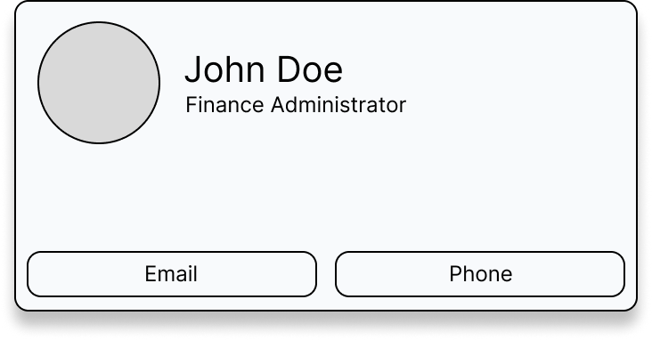

# Technical Test

This repository contains a collection of code examples, featuring both 
class-based and functional components. Each component represents a unique
challenge that mirrors tasks you may encounter in your daily work. These
challenges encompass common scenarios, including bug identification, code
refactoring, data fetching, and design implementation.

### What You Can Expect

In this repository, you'll find practical exercises aimed at assessing your
problem-solving and coding skills. Each example comes with clear instructions to
guide you through the task. These instructions serve as a roadmap to help you
understand what's expected and what an ideal solution should look like.

### Don't Hesitate to Ask Questions

If you come across anything you're uncertain about or have questions regarding
the challenges, please don't hesitate to reach out. This mirrors the
collaborative spirit of a real work environment, where seeking clarification and
collaborating with your peers are essential aspects of the job.

## Counter

This component is a simple counter that has two pieces of functionality, to
increment or decrement the count by 1. However, at the moment, there appears to
be a bug in the code.

When clicking on the increment button, the count correctly increments by 1.

When clicking on the decrement button however, the count does not change.

Can you look into what might be causing this bug and try to fix it?

**Expected behaviour** As a user, I should be able to click on either the
increment or decrement button and the count should change accordingly.

## Todos

This component is using an older API than the rest of the code base. It is a
class-based component and the rest of the code base is now using functional
components.

Are you able to refactor this component so that it is using a more modern syntax
like the rest of the code base?

**Expected behavior** As a user, I want the Todos list to look and function
exactly the same as it does now which is:

* [ ] - Completing a todo updates the UI to have a strike through text.
* [ ] - Deleting a todo removes the todo from the list and is no longer visible.

## Profile Card

This is a new component that needs to be built. A file has already been created
for you which you can find here `app/components/profile-card.js` - A wireframe
has been included to give you a rough idea of how the profile card should be
layed out.

**Expected Behaviour** As a user, I want to have the option to be able to call
or email a member of my team by clicking on the relevant button in the profile
card.

## Country Search

This component is a part of a new feature which should allow the user to search
for a country and then present the data back to them. You will be able to make
queries to the following API `https://restcountries.com/v3.1/name/{name}` where
name is replaced by the name of the country the user has typed in.

The look of this component is not important. Feel free to replace the
placeholders and or jazz up the design should you feel this would be a good or
nice thing to do.

**Expected Behaviour** As a user, when I search for a city, I would like to see
it's `common` and `official` name. I would also like to know what currency it
uses and what the `capital` is. Finally, I would like to be able to click a
link that will take me to that country on google maps.

### Getting started

Clone this repository down to your machine

`clone url`

Install node_modules

`install command`

Run your local dev server

`npm run dev`

### Additional Considerations

There are no intentional tricks within this repository. However there are some
things that that have been intentionally sloppy in some areas. If you spot
something that doesn't look quite right or you think it could be done better,
please make the necessary changes you feel would improve the codebase.

Finally, we are not expecting perfect code, nor all of the challenges to be
completely fixed. Instead, we are very interested in seeing how you approach
the challenges. So add comments and todos of things you would do and do
differently if you had more time to compete the challenges.

It is not recommended to spend more than a couple of hours on these challenges
as we appreciate participants will be sacrificing their own time to complete them.
